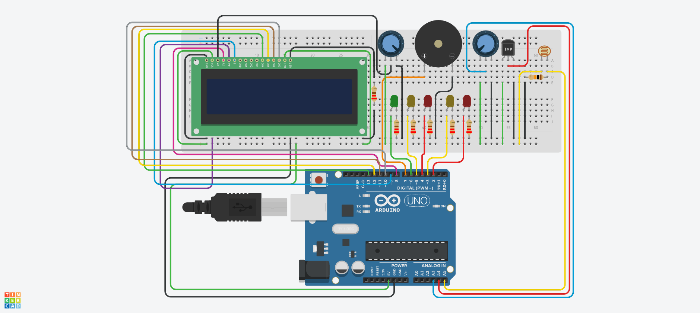

## Desenvolvimento e Entrega do Checkpoint 2 - Edge Computing and Computer Systems :rooster:

**Nomes + RM dos integrantes:**
- Guilherme Akio - 98582
- Matheus Motta - 550352
- Guilherme Morais - 551981
- Fabrício Saavedra - 97631	
- Vinicius Buzato - 99125

**Turma:** 1ESPW

**Ano:** 2023
___

### Descrição do Projeto
Após a apresentação da primeira parte do projeto para os proprietários da Vinheira, e o feedback positivo retornado por eles, recebemos alguns questionamento e solicitações de adições e modificações ao projeto. Dessa forma, fizemos as segunites atualizações para atender aos requisitos apresentados:
- O sistema passa a medir a temperatura e umidade do ambiente, utilizando o sensor integrado DHT11 (simulado através do sensor de temperatura TMP36 e de um potenciÔmetro no ambiente de testes).
- Os proprietários querem ver os valores de temperatura e umidade de alguma forma, por isso vocês utilizamos um display LCD para mostrar esses valores. 
- Os sinais de alerta foram mantidos e estendidos aos medidores de temperatura e umidade. Dessa forma, teremos leds e buzzers também indicando quando tais fatores não estiverem em suas respectivas faixas ideas. Além disso, introduzimos os alertas no display LCD, para um melhor entendimento do problema detectado.
___
### Desenvolvimento do projeto
O projeto foi desaenvolvido utilizando a aplicação web Autodesk Tinkercad, para a elaboração de protótipos e testagem de circuitos e códigos, e a plataforma Arduino, juntamente com seus componentes físicos, para a montagem efetiva do circuito.

A elaboração do circuito final, juntamente com seu código de execução, foi feita através de pesquisas por outros projetos que utilizassem sistemas semelhantes, e também consultas a outros códigos prontos com as funções desejadas no Tinkercad, forums da internet e a inteligência artificial ChatGPT,  bem como auxílio do professor em sala, até que foi possível arquitetar esta versão final adaptada a nossa necessidade. 

Assim, foi possível que fizéssemos atualizaçõesno circuito apresentado na primeira entrega, acrescentando as novas funcionalidades solicitadas pelo cliente. 
___
### Como executar o projeto
  Para executar o projeto serão necessários os seguintes softwares:
  - Autodesk Tinkercad (para reproduzir a simulação exibida [nesta imagem](Projeto_Tinkercad.jpg))
  - Arduino (juntamente com o código presente [neste arquivo](Codigo_Arduino.ino) - anexa também sua [versão em txt](Código_Arduino.txt.txt))
  
E também será necessário um kit básico de componentes físicos do Arduino, dos quais serão utilizados (é importante lembrar que a plataforma Tinkercad não possui o sensor DHT11, utilizado na versão física do projeto. Dessa forma, ao replicar a simulação, será necessário utilizar o sensor TMP36 para temperatura e um potenciômetro para simular a umidade):

<table>
  <tr>
    <td><b>Componente</b></td>
    <td align=center><b>Quantidade</b></td>
  </tr>
    <tr>
    <td>Arduino UNO R3</td>
    <td align=center>1</td>
  </tr>
  <tr>
    <td>Resistor 220Ω</td>
    <td align=center>6</td>
  </tr>
    <tr>
    <td>Resistor 10kΩ</td>
    <td align=center>1</td>
  </tr>
  <tr>
    <td>LED Vermelho</td>
    <td align=center>2</td>
  </tr>
  <tr>
    <td>LED Amarelo</td>
    <td align=center>2</td>
  </tr>
  <tr>
    <td>LED Verde</td>
    <td align=center>1</td>
  </tr>
  <tr>
    <td>Fotorresistor</td>
    <td align=center>1</td>
  </tr>
  <tr>
    <td>Potenciômetro 250kΩ</td>
    <td align=center>1</td>
  </tr>
  <tr>
    <td>Sensor DHT11</td>
    <td align=center>1</td>
  </tr>
  <tr>
    <td>Piezo</td>
    <td align=center>1</td>
  </tr>
  <tr>
    <td>LCD 16x2</td>
    <td align=center>1</td>
  </tr>
</table>

Para a montagem do circuito, basta reproduzir o [modelo do Tinkercad](Projeto_Tinkercad.png) utilizando os combonentes físicos listados. Para execução, é necessário conectar a placa Arduino Uno R3 a um computador via USB, inserir o [código de execução](Codigo_Arduino.ino) no programa Arduino e fazer o upload.
___
### Pré-requisitos
Para execução do projeto é necessário conhecimento sobre o uso da plataforma Autodesk Tinkercad, e experiência com o uso do programa Arduino e de seus componentes físicos. É necessário também saber usos básicos da linguagem C++ para entendimento do código e ajustes necesários.
___
### Video Explicativo
  [Link para o vídeo explicativo do projeto no Google Drive](https://drive.google.com/file/d/1xf-mtCMv0VZjnR7xjHWejM99nq8C-1Cr/view?usp=sharing)
